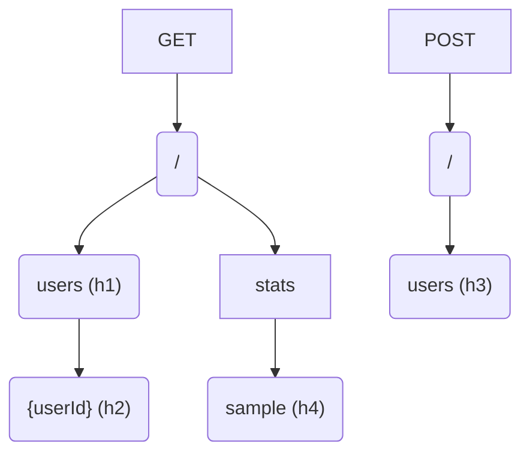

# HTTP router mux

Implementation of a request router/dispatcher based on a **radix tree** to enable fast route lookup.

## Usage

### Routes and handlers
```go
func main() {
	// Configure router
	mux := router.NewHttpRouter()
	
	// Handle with http.HandlerFunc
	mux.HandleFunc(router.GET, "/route/to/handle1", func(w http.ResponseWriter, r *http.Request) {
		// [...]
	})
	
	// Handle with http.Handler
	handler := CustomHandler{}
	mux.Handle(router.GET, "/route/to/handle2", &handler)
	
	// Support wildcards in path
	mux.HandleFunc(router.GET, "/route/{param1}/sample/{param2}", func(w http.ResponseWriter, r *http.Request) {
		// [...]
	})
	
	// Add middleware
	mux.UseMiddleware(middleware.LoggerMiddleware(loggerInstance))
	err := http.ListenAndServe("addr", mux)
	// [...]
}

type CustomHandler struct{}

func (c *CustomHandler) ServeHTTP(w http.ResponseWriter, r *http.Request) {
	// [...]
}
```

### Request parameters

```go
mux.HandleFunc(router.GET, "/route/{param1}", func(w http.ResponseWriter, r *http.Request) {
    // Get route parameter "param1" value
    routeParam, found := router.GetRouteParam(r, "param1")

    // Get query parameter value
    queryParam, found := router.GetQueryParam(r, "qparam1")

    // Get multiple query parameter values
    queryParams, found := router.GetQueryParamValues(r, "qparam2")

    // Get request value from either router or query
    param, found := router.GetParam(r, "param")
})
```

## Radix tree

Each registered route is split to form a tree, with the HTTP method as a route node. **Wildcards** are supported using the following syntax: `{wildcardName}`.
Example with routes registration (where "hx" is the handler's name):
- [GET] /users (h1)
- [GET] /users/{userId} (h2)
- [POST] /users (h3)
- [GET] /stats/sample (h4)



